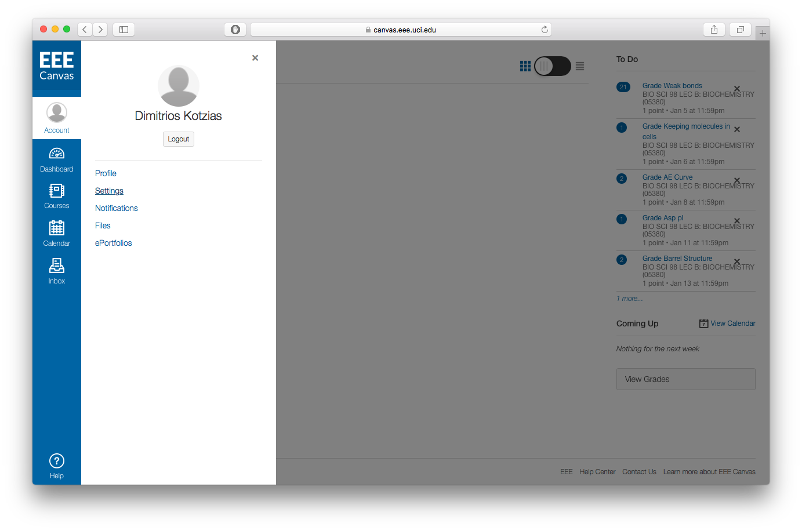
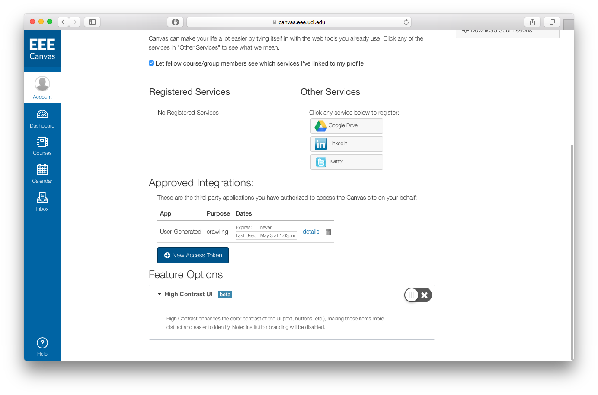
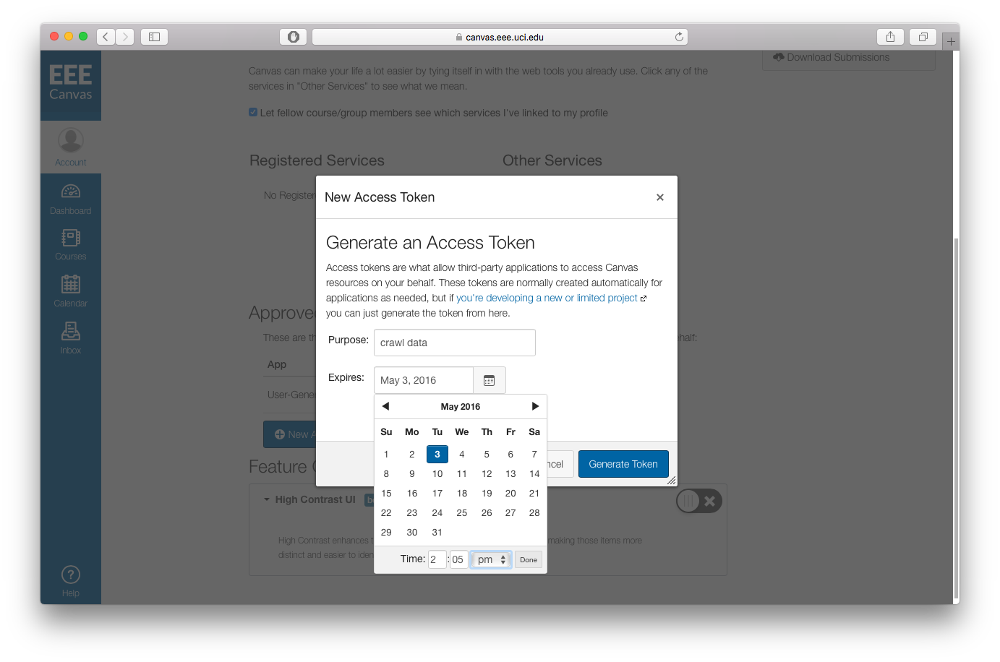
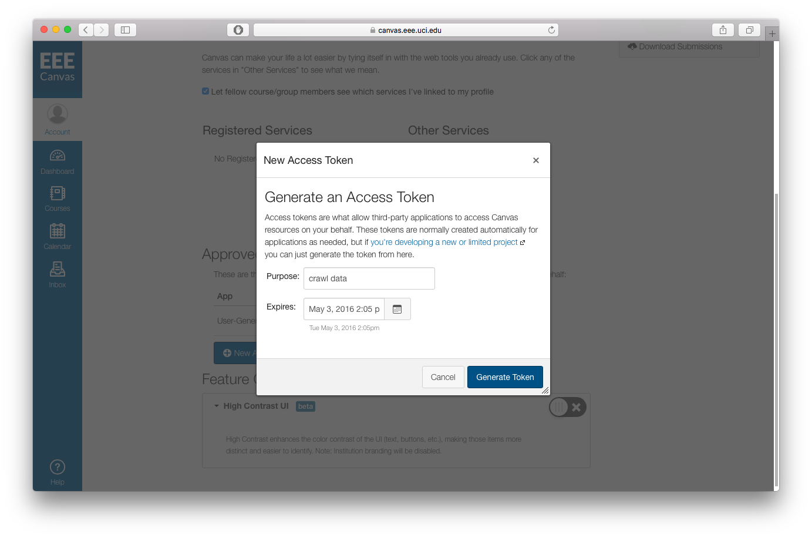
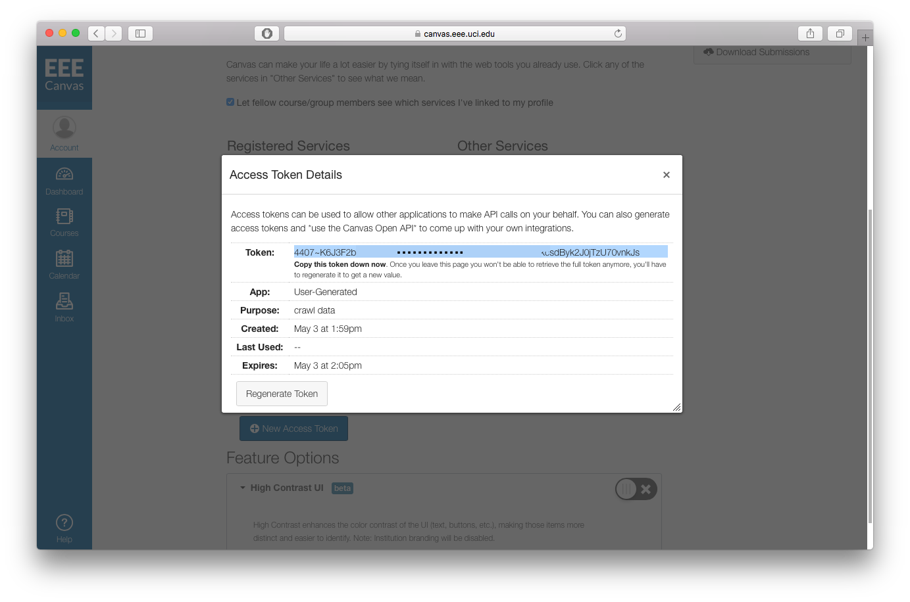

# canvas-api-python
Python Code that has a simple interface, for using the Canvas LMS API. In addition, there is a class that downloads data from a specific course in .csv files for data analysis. 

#Intro
Canvas is a Learning Management System (LMS) which is currently being adopted by multiple schools around the US. It is used to assign homeworks, give out grades, quiz taking and whole bunch of other good stuff that universities need. For more info go to the [Canvas Website](https://www.canvaslms.com)

The code that lives in this repository, provides a crawler for the data of a course in Canvas through a simple python interface for the Canvas API. 

For non-computer science people, it is an easy way to 'talk' to the canvas servers of a school, and download usage data for a specific course using the programming language Python. Its very simple to use, even if you know very little Python, and it saves the data as .csv files. 

#How to use (download data for a course)
0. Download this directory (Download ZIP button in the top right).
1. Install Python. To do that easily, simply [install anaconda] (https://docs.continuum.io/anaconda/install)
1. Have Access to the data. In order for this to work, the person creating the token, should be a TA or a Professor
3. Edit the **config.txt** file. 
	* Paste your own access token (instructions on how to generate one are below)
	* Change the url to reflect the url of your school (what is now https://canvas.eee.uci.edu)
	* Change the course id. (To find this, log in canvas, go to the course you would like to download, look at the url in your browser - its the number after /courses/)
4. Run the Code
	* Open a Terminal 
	* `cd` in the directory that you downloaded from here, and type
	* `python CourseCrawler.py`
5. Explore the data under the `data` directory. 
6. Data Party :sunglasses: :musical_note: :computer: :bar_chart: 

#Generate an Authorization Token in Canvas LMS
Login to your instance on canvas, and go to **Account->Settings**

Scroll Down and click on **New Access Token**

Set a time limit for your token. (Optional, but wise in case it gets compromised)

Click on **generate**

**Copy** your token string (this very large weird letters and numbers)

